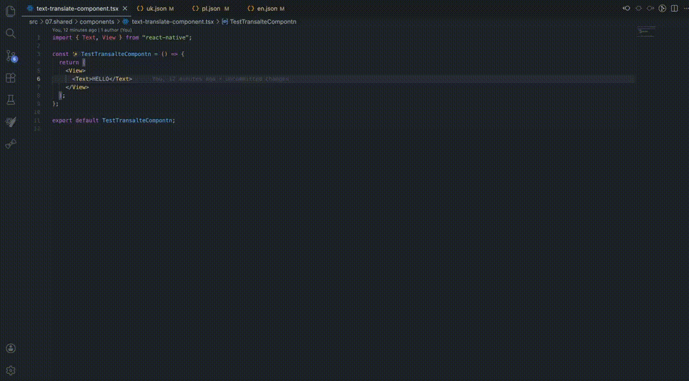

# i18n Assistant

VS Code extension that extracts hardcoded UI strings into JSON dictionaries and replaces inline text with translation calls.

## Demo



## Why

Managing i18n manually is slow and error-prone:

- you copy text into multiple dictionaries;
- you insert translation keys by hand;
- you forget imports/hooks;
- monorepo apps write into wrong dictionary folders.

i18n Assistant automates this flow directly in the editor.

## What it does

- Extract selected text via command, context menu, Quick Fix, or Refactor.
- Open a single Webview form for key + all language values.
- Update JSON dictionaries for configured languages.
- Replace selected text with translation call, for example {t("common.hello_world")}
- Add missing import and hook snippet automatically.
- Support multiple i18n providers (react-i18next, next-intl, custom).
- Support monorepo dictionary roots.
- Optionally run a post-hook command after extraction.

## Quick Start

### Install from VSIX

1. Open Extensions in VS Code.
2. Click ... menu.
3. Select Install from VSIX....
4. Pick the generated VSIX file in this folder.

### Development mode

1. Open this folder in a dedicated VS Code window.
2. Press F5.
3. In Extension Host open your app workspace.

## Usage

### Option 1: command

1. Select text inside component.
2. Run i18n: Extract Selected Text.
3. Fill key and translations.
4. Click Save and Replace.

### Option 2: editor context menu

1. Select text.
2. Right click.
3. Choose i18n: Extract Selected Text.

### Option 3: Quick Fix / Refactor

1. Put cursor inside string literal.
2. Open Code Actions.
3. Choose Extract to i18n dictionary.

## Configuration

Set in VS Code Settings JSON.

### Core

- i18nAssistant.languages: list of language codes.
- i18nAssistant.baseLanguage: reference language.
- i18nAssistant.dictionaryRootPath: single dictionary root (relative to workspace).
- i18nAssistant.dictionaryRootPaths: optional list of roots for monorepo.
- i18nAssistant.dictionaryDir: dictionary folder name relative to selected root.
- i18nAssistant.missingTranslationStrategy: empty-marker or copy-base.

### Post-hook

- i18nAssistant.runPostHook: true or false.
- i18nAssistant.postHookCommand: command to run after successful extraction.

### Translation provider

- i18nAssistant.translationImportModule
- i18nAssistant.translationImportName
- i18nAssistant.translationHookSnippet
- i18nAssistant.translationFunctionName

## Presets

### react-i18next

```json
{
  "i18nAssistant.translationImportModule": "react-i18next",
  "i18nAssistant.translationImportName": "useTranslation",
  "i18nAssistant.translationHookSnippet": "const { t } = useTranslation();",
  "i18nAssistant.translationFunctionName": "t"
}
```

### next-intl

```json
{
  "i18nAssistant.translationImportModule": "next-intl",
  "i18nAssistant.translationImportName": "useTranslations",
  "i18nAssistant.translationHookSnippet": "const t = useTranslations();",
  "i18nAssistant.translationFunctionName": "t"
}
```

### next-intl with namespace

```json
{
  "i18nAssistant.translationHookSnippet": "const t = useTranslations('common');"
}
```

## Monorepo Example

```json
{
  "i18nAssistant.dictionaryRootPaths": [
    "apps/app",
    "apps/landing",
    "apps/business"
  ],
  "i18nAssistant.dictionaryDir": "dictionaries"
}
```

The extension picks the nearest root for the active file.

Example:

- editing file in apps/landing/src/... updates apps/landing/dictionaries/\*.json
- editing file in apps/business/src/... updates apps/business/dictionaries/\*.json

## Validation

```bash
npm run test
```

## Troubleshooting

- Webview opens but nothing changes:
  - ensure you use latest VSIX build;
  - ensure dictionaries exist for all configured languages.
- Dictionary file not found:
  - verify dictionaryRootPath/dictionaryRootPaths + dictionaryDir.
- No Quick Fix shown:
  - use JS/TS/JSX/TSX file;
  - cursor must be inside a string literal.

## Roadmap

- AST-based replacement for edge-case safety.
- Output channel for step-by-step diagnostics.
- Optional key naming templates by folder/domain.

## Detailed Guide

For full real-world setup and examples see REAL_WORLD_GUIDE.md.
